  
📋

  
Blueprint SOP Kebocoran

  
Operational Excellence Framework

  
Banyak PDAM memiliki aplikasi pelaporan, namun gagal menurunkan tingkat kebocoran. Mengapa? Karena <strong>aplikasi seringkali terputus dari eksekusi lapangan</strong>. Dokumen ini merancang proses bisnis <em>end-to-end</em> untuk memastikan setiap notifikasi dari "Laporan Kebocoran PDAM" dikonversi menjadi tindakan perbaikan yang terukur.

## 🔄 The Golden Workflow (Director's Cut)

Workflow ini telah disesuaikan untuk efisiensi biaya operasional (OPEX) dan minimalisir laporan palsu.

```mermaid
graph TD
    A[🧑 Warga Melapor] -->|Wajib Foto + GPS| B(📥 Admin Pusat)
    B -->|Validasi Halaman Web| C{Valid?}
    C -- Tidak/Hoaks --> D[❌ Reject & Blokir User]
    C -- Ya --> E[👷 Terbit SPK Digital]
    E --> F[🚚 Tim URC Luncur]
    F -->|Cek Lapangan| G{Bisa Langsung?}
    G -- Ya --> H[🛠️ Eksekusi & Foto Hasil]
    G -- Butuh Alat Berat --> I[⚠️ Eskalasi ke Kabag]
    H --> J[✅ Verifikasi & Tutup Tiket]
    I --> J
```

---

## ⏱️ Service Level Agreement (SLA) & Eskalasi

Target waktu harus punya konsekuensi. Sistem harus mengirim **Eskalasi Otomatis** jika target meleset.

<table>
<thead>
<tr>
<th>Prioritas</th>
<th>Target Respon</th>
<th>Target Selesai</th>
<th>Eskalasi Jika Telat</th>
</tr>
</thead>
<tbody>
<tr>
<td><strong>🔥 Critical</strong></td>
<td>15 Menit</td>
<td>&lt; 4 Jam</td>
<td><strong>Langsung ke Direktur Teknik</strong></td>
</tr>
<tr>
<td><strong>⚠️ High</strong></td>
<td>30 Menit</td>
<td>&lt; 12 Jam</td>
<td>Ke Kepala Bagian Distribusi</td>
</tr>
<tr>
<td><strong>ℹ️ Normal</strong></td>
<td>1 Jam</td>
<td>&lt; 24 Jam</td>
<td>Ke Kepala Seksi</td>
</tr>
</tbody>
</table>

---

## 💎 Protokol Efisiensi (Hemat Biaya)

Sebagai Direksi, kita harus memastikan **Cost per Tiket** semurah mungkin.

### 1. Filter Hoaks (Pre-Screening)
"Mengirim truk tangki/tim gali itu mahal (BBM + SDM)".
- **Aturan:** Admin dilarang menerbitkan SPK jika foto buram/tidak jelas.
- **Tindakan:** Telepon pelapor untuk verifikasi lisan sebelum tim berangkat.

### 2. Zoning System (Penghematan BBM)
Jangan kirim tim "bola ping-pong" dari ujung utara ke selatan.
- Kumpulkan laporan "Normal" (non-critical) dalam satu zona wilayah.
- Eksekusi sekaligus dalam satu kali jalan (Route Optimization).

### 3. Insentif Berbasis Poin (Performance Based)
Ubah mindset "Kerja banyak = Capek" menjadi "Kerja banyak = Bonus".
- Tiap kebocoran **High** = 5 Poin.
- Tiap kebocoran **Normal** = 2 Poin.
- Akumulasi poin bulanan dikonversi menjadi Insentif Kinerja Tim URC.

---

  <h3>⚡ Instruksi Direksi</h3>
  
"SOP ini bukan hiasan dinding. Mulai besok, setiap Rapat Evaluasi Mingguan, saya minta laporan: <strong>Jumlah laporan yang pending > 24 jam</strong>. Jika masih ada, Kabag Distribusi harap siapkan alasannya."

